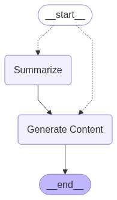

# AI-Word-Processor

Given an outline, AI Word Processor can generate the content. It can be useful to write reports, manuscripts or any textual document that has a fixed outline. The outline must be provided as markdown style section headers and subheaders with <content> tags which the AI would be replacing.

**Example of an outline**

```
# Title:
## Introduction
<content>
### 1. Sub header
<content>
### 2. Sub header
<content>
## Next sub section header
### 1. Sub header
<content>
```

## Frontend

Frontend is developed using Shiny for Python (py-shiny). The account credentials are saved in a PostgreSQL database

## Backend

### Base

Backend contains agents developed by Langgraph architecture. The graph starts with _previous content_ and _current section header_. If the size of previous contents is too large (> 500 tokens), the content gets summarized at the "Summarize" node and the result is passed on to the "Generate Content" node along with the _current section header_. "Generate Content" node generates the text based on the _previous content summary_ and _current section header_.



## Running the app

- Create python environment.\
  - `pip install uv`
  - `uv sync`
- Create ".env" file with the required credentials, following "example.env" file.
  - `cp example.env .env`
  - Add the credentials in ".env" file.
- Run the app\
   `uv run shiny run app.py`

  or

  `uv run shiny run app.py -p <port>`
