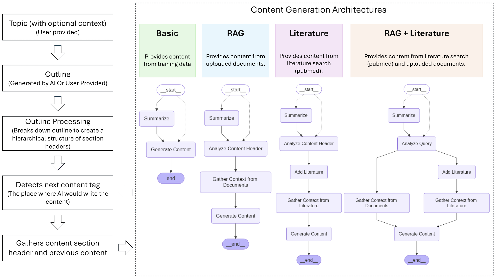

# AI-Word-Processor

Given an outline, AI Word Processor can generate the content. It can be useful to write reports, manuscripts or any textual document that has a fixed outline. The outline must be provided as markdown style section headers and subheaders with <content> tags which the AI would be replacing.

**Example of an outline**

```
# Title:
## Introduction
<content>
### 1. Sub header
<content>
### 2. Sub header
<content>
## Next sub section header
### 1. Sub header
<content>
```

## Frontend

Frontend is developed using Shiny for Python (py-shiny). The account credentials are saved in a PostgreSQL database

## Backend

### Base

Backend contains agents developed by Langgraph architecture. The graph starts with _previous content_ and _current section header_. If the size of previous contents is too large (> 500 tokens), the content gets summarized at the "Summarize" node and the result is passed on to the "Generate Content" node along with the _current section header_. "Generate Content" node generates the text based on the _previous content summary_ and _current section header_.



**Detailed architecture is represented in this [link](docs/README.md).**

## Running the app

### Setting up environment variables

Refer to the example.env file for the required environment variables. Create a .env file in the root directory of the project and add the required credentials. Below is an example of the .env file structure:

```yaml
# AI (Required for content generation)
AI_BASE_URL=<URL to AI service>
AI_API_KEY=<API key for AI service>

# Langfuse (Optional, used for debugging)
LANGFUSE_SECRET_KEY=<Secret key for Langfuse>
LANGFUSE_PUBLIC_KEY=<Public key for Langfuse>
LANGFUSE_HOST=<URL to Langfuse instance>

# ChromaDB (Required for RAG pipeline)
CHROMA_HOST=<Host for ChromaDB>
CHROMA_PORT=<Port for ChromaDB>

# PostgreSQL Database (Required for backend storage)
HOST=<Database host>
USER=<Database user>
PASSWORD=<Database password>
PORT=<Database port>
DATABASE=<Database name>

# NCBI (Requried for PubMed access)
NCBI_API_KEY=<NCBI API key>
```

### Running app locally

**Using uv**

Use the following steps to run the app with uv:

- Create python environment.\
  - `pip install uv`
  - `uv sync`
- Create ".env" file with the required credentials, following "example.env" file.
  - `cp example.env .env`
  - Add the credentials in ".env" file.
- Run the app\
   `uv run shiny run app.py`

  or

  `uv run shiny run app.py -p <port>`

**Using Docker**

Use the following command to run the app with Docker:

`docker compose up --build`

# Contact

<div class="d-flex flex-column">
<div>Amlan Talukder</div>
<div>Data Scientist (Contractor)</div>
<div>Office of Data Science, NIH/NIEHS</div>

<amlan.talukder@nih.gov>

</div>
