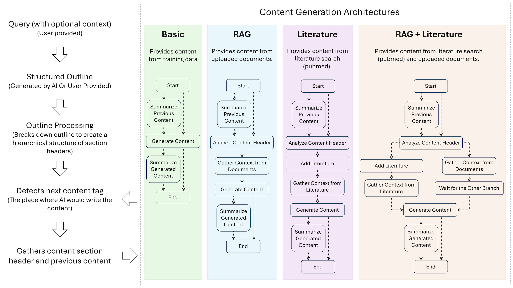

# Discourse2Draft

**An AI word processor for structured document generation**

Given a query or an outline, Discourse2Draft can generate the content. It can be useful to write reports, manuscripts or any textual document that has a fixed outline. The outline must be provided as markdown style section headers and subheaders with <content> tags which the AI would be replacing.

**Example of an outline**

```
# Title: Quantum Computing and its Applications
## Introduction
[--instructions--]
- High-level overview of quantum computing
- Importance and potential applications
[/--instructions--]
[--content--]
## 1. History of Quantum Computing
Quantum computing has its roots in the early 1980s when physicist Richard Feynman proposed the idea of a quantum computer that could simulate physical systems more efficiently than classical computers. Over the years, significant milestones have been achieved, including the development of quantum algorithms like Shor's algorithm for factoring large numbers and Grover's algorithm for database searching.
[--content--]
## 2. Quantum Information Processing
### Quantum Bits (Qubits)
[--instructions--]
- Definition of qubits
- Comparison with classical bits
- Types of qubits (e.g., superconducting, trapped ions)
[/--instructions--]
[--content--]
### Unary Operators
[--content--]
```

## Frontend

Frontend was developed with ReactJS and Vite.

## Backend

Backend was developed by python. PostgreSQL database was used as the backend database. ChromaDB was used for RAG.

### Base

Backend contains agents developed by Langgraph architecture. The graph starts with _previous content_ and _current section header_. If the size of previous contents is too large, the content gets summarized at the "Summarize" node and the result is passed on to the "Generate Content" node along with the _current section header_. "Generate Content" node generates the text based on the _previous content summary_ and _current section header_.



**Detailed architecture is represented in this [link](docs/README.md).**

## Running the app

### Add settings

Create ".env" file with the required settings, following "example.env" file.

`cp example.env .env`

Add the following settings in ".env" file.

#### AI settings

```yaml
# AI (Required for content generation)
AI_BASE_URL=<URL to AI service>
AI_API_KEY=<API key for AI service>

# Default AI Model (Can be replaced by the preferred LLM options)
DEFAULT_AI_MODEL='azure-o3'
DEFAULT_AI_TEMPERATURE=0
DEFAULT_AI_INSTRUCTIONS=''
```

#### RAG and content generation settings

```yaml
# Maximum number of tokens allowed for previous contents summary of a section
NUM_TOKENS_SUMMARY = 500

# Number of tokens allowed in the context of a single LLM call
MAX_CONTEXT_TOKENS = 2000

# Maximum number of keyphrases to extract for RAG and Literature Search
# from analyzing the previous contents summary and the current content header.
MAX_KEYPHRASES = 10
MAX_KEYPHRASES_LIT_SEARCH = 5

# Maximum number of articles allowed for literature search
NUM_MAX_LITERATURE = 2

# Maximum number of content allowed from each article returned by the literature search
MAX_CONTENT_SIZE_PER_LITERATURE = 20000

# Similarity metric and threshold for retrieving relevant documents from the vector database (ChromaDB) for RAG and Literature Search
SIMILARITY_METRIC = 'similarity_score_threshold'
SIMILARITY_THRESHOLD = 0.3

# Maximum number of relevant documents to retrieve from the vector database (ChromaDB) for RAG and Literature Search
NUM_DOCS_MAX = 5
```

#### Other settings

```yaml
# NCBI (Optional, required for access of higher number of articles from PubMed)
NCBI_API_KEY=<NCBI API key>

# Mail service (Mailgun) (Optional, required for password retrieval during authentication)
MAILGUN_DOMAIN=<Mailgun domain>
MAILGUN_API_KEY=<Mailgun API key>
```

#### Database settings

```yaml
# ChromaDB (Required for RAG pipeline)
CHROMA_HOST=<Host for ChromaDB>
CHROMA_PORT=<Port for ChromaDB>

# PostgreSQL Database (Required for backend storage)
DB_HOST=<Database host>
DB_USER=<Database user>
DB_PASSWORD=<Database password>
DB_PORT=<Database port>
```

To set up with docker container the following variables must be set with the assigned values

```yaml
# ChromaDB (Required for RAG pipeline)
CHROMA_HOST="chroma"
CHROMA_PORT="8000"

# PostgreSQL Database (Required for backend storage)
DB_HOST = 'postgres'
DB_USER = 'postgres'
DB_PASSWORD = 'root'
DB_PORT = 5432
```

### Run app

**Using uv**

- Create python environment using uv.
  - `pip install uv`
  - `uv sync`
- Run app with uv
  - `uv run shiny run app.py -p <port>`

The app can be accessed at `http://127.0.0.1:<port>/`

**Using Docker**

Use the following command to run the app with Docker:

`docker compose up -d`

The app can be accessed at `http://127.0.0.1:5173/`

# Contact

<div class="d-flex flex-column">
<div>Amlan Talukder</div>
<div>Data Scientist (Contractor)</div>
<div>Office of Data Science, NIH/NIEHS</div>

<amlan.talukder@nih.gov>

</div>
