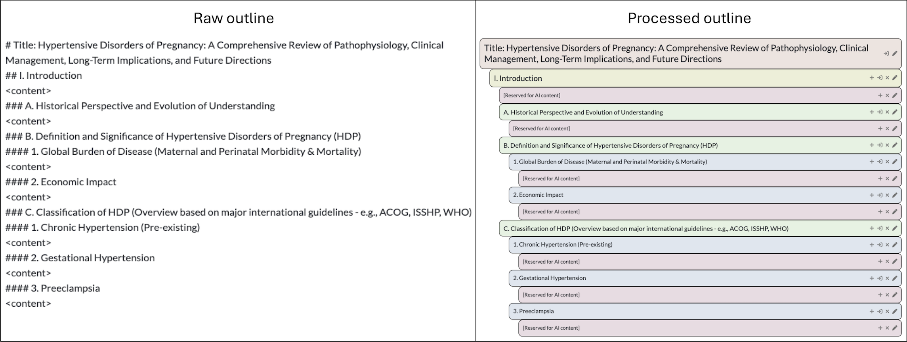
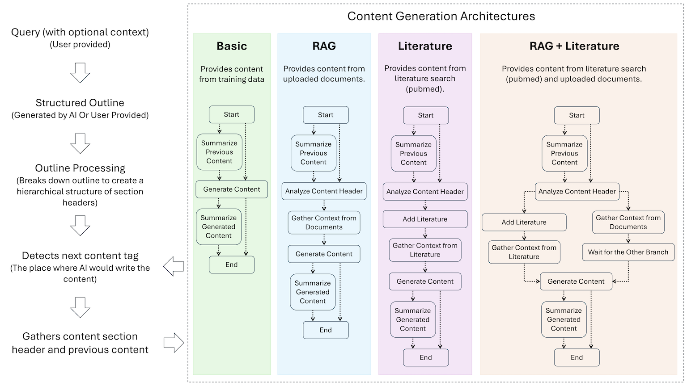
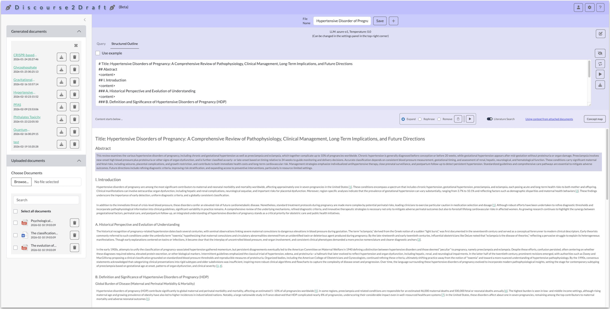
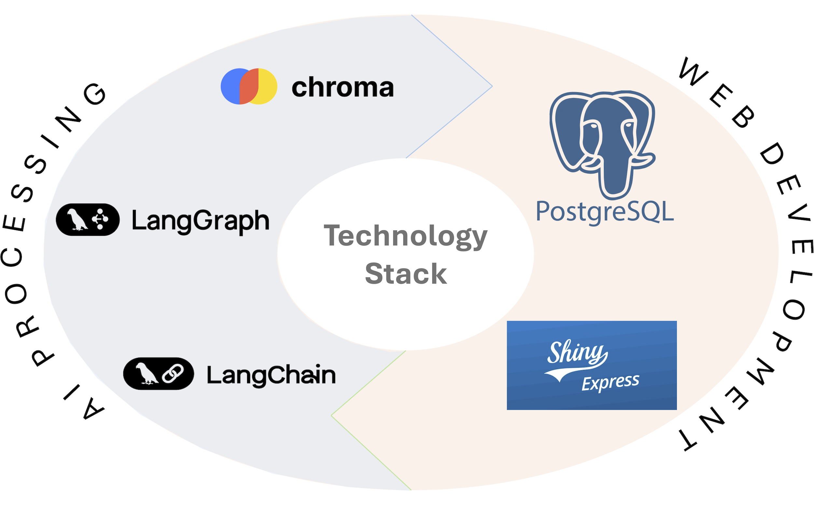

# Introduction

_Discourse2Draft_ is a model-agnostic, retrieval-augmented generation (RAG) application that converts any topic with optional primer into an exhaustive alphanumeric outline and, from that outline, into a polished long-form draft, using context from user provided documents or literature downloaded from pubmed or both. The system can also take the outline directly from the user. The system extracts the hierarchical structure from the outline (either ai generated or user provided) and detects positions to write content. It then orchestrates prompts to user-selectable large-language models from different providers (eg. OpenAI, Google, Anthropic etc.) to extract core ideas from the corresponding section headers and previously written text for every writable position, fill that position with cohesive prose with context taken from user provided documents or online literature, and automatically weave source-anchored citations throughout the text. For every factual statement the manuscript contains, _Discourse2Draft_ computes a 1-to-10 confidence score—derived from log-probability distributions, so authors can quickly identify claims that may require verification or additional evidence. The draft with confidence scores, associated references and the bibligraphy can be exported in DOCX or markdown format, ensuring full transparency and downstream editability. By coupling multi-vendor LLM flexibility with traceable knowledge retrieval and granular certainty metrics, _Discourse2Draft_ streamlines the journey from informal dialogue to publication-quality writing while keeping scientific rigor and author oversight at the forefront.

# Methods

## User account

_Discourse2Draft_ can be accessed without creating an account. But an user account is helpful to store the generated and uploaded documents and associated settings forever.

## User inputs

### Topic and outline

<strong>Figure 1: </strong>&nbsp;Raw outline input format of content creation. The right panel shows the hierarchy of how the outline is processed from the raw text of the left panel.

_Discourse2Draft_ offers flexibility in terms of user interactions. It can start from a bare minimum of a topic name. _Discourse2Draft_ will create an outline from the topic and provide the user an option to make changes to the generated outline with an interactive user interface (UI). To have better control over the outline generation process, user can also provide a primer on the topic which can be either a short summary or a discussion or any related context on the topic. Upon saving the generated outline, the user will be taken to the document generation UI where the AI will create contents under each section or subsection of the outline.

An alternative route skips the outline generation step and takes the outline directly from the user. The outline is taken as a markdown format. The detailed rules on outline creation as follow,

**Outline format:** _Discourse2Draft_ basically converts an outline into a structured draft. The outline can either be generated from a user-provided topic with optional short description or can be taken from the user directly. In the latter case, the user needs to provide a well-formatted outline. The outline must maintain the standard markdown section hierarchy with the number of "#"s, where the each hierarchy level header is preceded by "#"s. One "#" means the topmost level (which typically is the title of the outline) and consistent increment in the number of "#"s would ensure the sub-levels, e.g. two "#"s mean the second level hierarchy (e.g. Abstract, Introduction etc.) and so on. An outline must begin with one "#" (top-level hierarchy). The position where the AI needs to write the content has to specified with a "<content>" tag (Figure 1).

### Document upload

_Discourse2Draft_ has the facility of uploading documents in "text (TXT)", "Microsoft Word (DOCX)" or "PDF" formats from user machine. The uploaded documents are stored in a relational database associated with the user account (if the user signed in) or the active session (if the user did not sign in).

## Content generation

<strong>Figure 2: </strong>&nbsp;Behind-the-scene user input processing steps and different AI architectures.

### Outline processing

_Discourse2Draft_ either takes an outline from the user or create one based on the user provided topic with an optional context. It then breaks the outline in a hierarchical structure, checks for validation and finally detects the position of the outline where it needs to fill with generated contents (denoted by the "<content>" tags). It then gathers the headers (section or subsection headers specified by "#"s) of that position and the previously generated contents to ensure the consistency in the content generation. (Figure 2). It provides the headers and previous contents to the suitable AI architecture.

### AI architectures

Discouse2Draft follows different architecture scenario based on user interactions (Figure 2). First, to ensure that the number of context-tokens does not exceed the limit of underlying LLM, it summarizes the previously written contents if it contains over 500 tokens.

**Basic:** In this architecture it generates content from the training data of associated LLM, based on the headers and previously written contents. This architecture is set as default.

**RAG:** The user can make the LLM consider context from user provided documents by attaching the uploaded document(s) with the document file. When a context document is attached, it is first divided into chunks of 1,000 characters of text with an overlap of 200 characters and then each chunk of text is converted into an embedding vector and saved into a vector database as a "collection" (_document collection_). When generating content for a file with attached documents, _Discourse2Draft_ would follow the basic "RAG" architecture. In this architecture, the LLM will analyze the previous contents and current section headers to generate 10 semantically independent key-phrases on the topic. Then each key-phrase is semantically searched in the vector database collection to find a set of semantically similar chunks of texts. The key-phrases and the retrieved texts from the vector database are passed to the LLM as context. The LLM considers the provided context along with its training data to generate the final content.

**Literature:** Apart from user uploaded documents, _Discourse2Draft_ also has the ability to gather content from online literature database. This ability is turned on by a button named "Literature Search" above the content panel (Figure 3). When this button is turned on, _Discourse2Draft_ continues the similar steps in the "Basic RAG" architecture replacing the vector database search with literature search. It uses each key-phrase generated in the "RAG" architecture to query against the literature database and picks the best match literature. The content of the literature is then processed in the same way as the "RAG" document and saved in the vector database as a "collection" (_literature collection_}). The rest of the steps are the same as the "RAG" architecture.

**RAG + Literature:** This architecture, as the name suggests, merges both "RAG" and "Literature" architectures. Here each key-phrase, generated after analyzing the previous contents and the current section headers, will be used for both searching the _document collection_ and the _literature collection_ of the vector database to retrieve semantically similar text chunks from both sources. The text chunks are then passed to the LLM as context. The LLM considers the provided context from uploaded documents and literature search along with its training data to generate the final content.

<strong>Figure 3: </strong>&nbsp;Content generation window of the app. The top left and bottom left panels show the generated and user uploaded files. The top right panel contains the outline. The bottom right panel contains the generated content.

### Referencing

When a document is uploaded, a record is created in a relational database. Similarly, when a literature is searched the metadata on the literature is saved as a record in the relational database. In "RAG", "Literature" and "RAG + Literature" architectures, the LLM use text chunks retrieved from the vector database as context to generate the final content. Each text chunk is tagged with the corresponding record identifier (id) from the relational database. Each text chunk provided to the LLM as context is associated with the id. The LLM is instructed to cite the id of a text chunk at the end of every group of sentences it generates using that text chunk. The cited id is then pro grammatically processed to create citation at the specified position of the content and a list of references of the cited documents and literature at the end of the content (Figure 3).

## Outputs

_Discourse2Draft_ provides the facility to download the generated document and bibliography of the associated references. The download options are shown beside the outline panel, in the generated documents panel and the expanded view of this panel, which is opened by clicking the expand button on the top right corner of this panel. When the download button is clicked, the user is shown the download options of the content document in either "markdown (md)" or "Microsoft Word (DOCX)" formats. When the content has references, clicking the download button show a popover with the options to download both the content and the bibliography of the references in "bibtex" format.

## LLMs

In the current version of _Discourse2Draft_, o3, o3-mini, o1, o1-mini, GPT-4o (OpenAI), Claude 3.7 sonnet, Claude 3.5 sonnet (Anthropic), Gemini 1.5 Flash, Gemini 1.5 Pro (Google), Llama 3.3 70B, Llama 3.2 90B, Llama 3.1 405B, Llama 3.1 70B (Meta) and Mistral Large 2 (Mistral) are available to select as the underlying LLM. The LLM, temperature and instructions can be provided on the settings window by clicking the "gear" icon of the top right corner.

<strong>Figure 4: </strong>&nbsp;The technology stack used to develop the app.

## Technology Stack

_Discourse2Draft_ was built using python programming language. The front-end of _Discourse2Draft_ was developed using python-shiny. For the relational database in the back-end PostgreSQL was used. LangChain and LangGraph were used to create and manage the AI architectures. Chroma was used as the vector database (Figure 4).

# Contact

Amlan Talukder

Data Scientist (Contractor)

Office of Data Science, NIH/NIEHS

<amlan.talukder@nih.gov>

