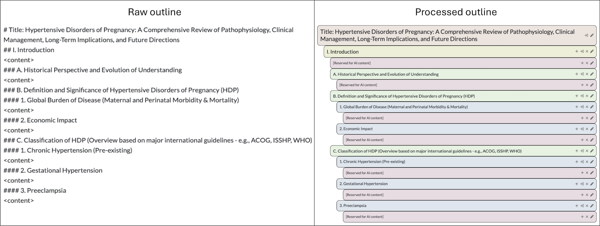
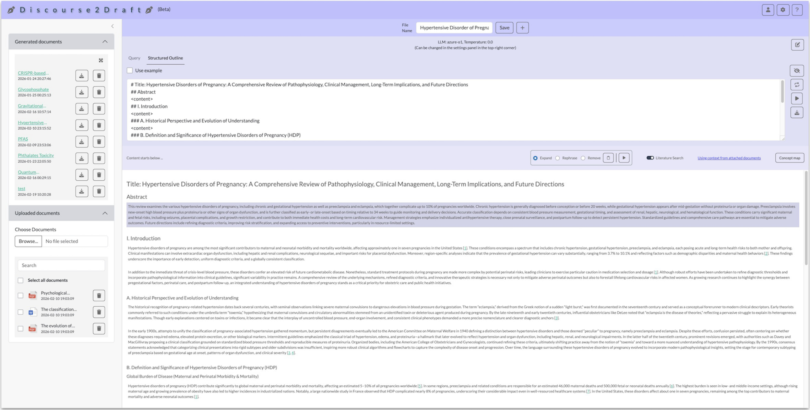
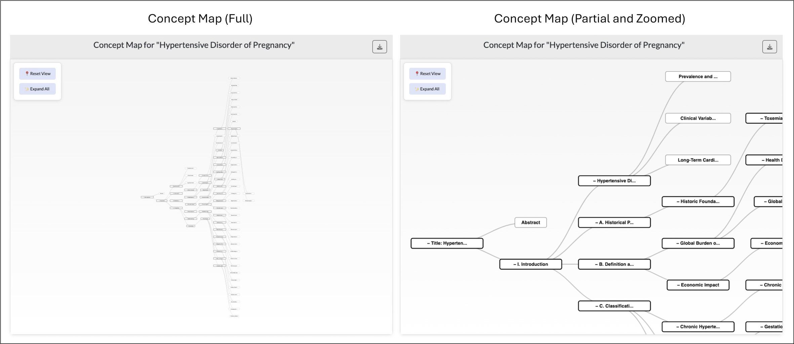

# Introduction

_Discourse2Draft_ is a model-agnostic, retrieval-augmented generation (RAG) based application that converts a user-provided query into an exhaustive structured outline and, from that outline, into a polished long-form draft, using context from user provided documents, literature downloaded from \emph{PubMed}, or both. The system can also take the structured outline directly from the user. The system extracts the hierarchical structure from the outline (either AI-generated or user provided) and detects positions to write content. It then orchestrates prompts to large-language models (LLMs) to extract core ideas from the corresponding section headers and previously written text for every writable position, fills those positions with cohesive prose with context taken from user provided documents or online literature, and automatically weaves source-anchored citations throughout the text. The draft with associated references and the bibliography can be exported in Microsoft Word, LaTeX and Markdown formats, ensuring full transparency and downstream editability. By coupling multi-vendor LLM flexibility with traceable knowledge retrieval and granular certainty metrics, _Discourse2Draft_ streamlines the journey from informal textual query to publication-quality writing while keeping scientific rigor and author oversight at the forefront.

# Methods

## User account

_Discourse2Draft_ can be accessed without creating an account, but a user account is helpful to store the generated and uploaded documents and associated settings. The settings include API key and URL of the LLM provider, temperature of the LLM, and generic instructions for the content generation.

## User inputs

### Query and outline

<strong>Figure 1: </strong>&nbsp;Raw outline input format of content creation. The right panel shows the hierarchy of how the outline is processed from the raw text of the left panel.

_Discourse2Draft_ offers flexibility in terms of user interactions. It accepts as input either a user query (e.g. "Write a review article on Quantum Computing.'') or a structured outline of the draft following a set of rules mentioned in the next paragraph. With a structured outline, the user has more control over the generated content as it strictly follows the user provided outline. If a user query is provided as input, the system first creates a structured outline and then starts writing the content. So, creating a structured outline is the first essential step in _Discourse2Draft_. The user can make changes to the generated outline with an interactive user interface (UI).

**Query tab:** The user can provide a query and upload a reference file (if necessary). Next, the user can click the "Create outline" button, which will generate a structured outline from the query considering the reference file (if provided).

**Structured Outline tab:** The user can directly provide a structured outline following _Discourse2Draft_ provided guidelines. This helps the AI model parse the structured outline and identify places where it needs to generate content. It also helps the AI model extract the pre-written summary of the content, which is useful to maintain continuity when generating the new content.

**Structured Outline Guidelines:** The structured outline must maintain the standard Markdown section hierarchy where each hierarchy level header is preceded by a number of "\#"s. One "\#" denotes the topmost level (which is typically the title of the outline), and incrementing the number of "\#"s denotes further sub-levels in the hierarchy (e.g., a string of two "\#"s defines titles at the second hierarchical level, such as "Abstract,'' "Introduction,'' etc.). An outline must begin with one "\#" to define the top-level hierarchy. The position where the AI needs to write the content has to be specified with a "\<content\>" tag. The user can add additional instructions for content generation under each section (or sub-section) by enclosing the instructions within "\<Instructions\>" and "\</Instructions\>" tags (Figure 1).

### Document upload

_Discourse2Draft_ can use user-uploaded documents during content generation. The documents can be uploaded as "text (.txt)", "Microsoft Word (.docx)" or ".pdf" formats from the user machine on the "Upload documents" panel in the bottom left corner of the UI. The uploaded documents can later be attached to a new file for content generation. The uploaded documents' IDs are stored in a PostgreSQL relational database associated with the user account (if the user signed in) or the active session (if the user did not sign in).

## Content generation

<strong>Figure 2: </strong>&nbsp;Behind-the-scene user input processing steps and different AI architectures.

### Outline processing

To write a document, _Discourse2Draft_ either takes a structured outline from the user or creates one based on the user provided query. It then breaks the outline into a hierarchical structure (Figure 1), validates it, and detects the first position in the outline where it needs to write (denoted by the "\<content\>" tag). It then gathers the header chain specified by "\#"s of that position from the topmost level (title -> section -> subsection -> sub-subsection etc.) and the generated content so far to ensure the relevance and consistency in content generation. It also gathers the instructions for the corresponding section, if any are provided within "\<Instructions\>" and "\</Instructions\>" tags. It then detects if the outline has an "Abstract" section or a section with a similar header e.g. "Summary", "Synopsis", "Outline," etc. _Discourse2Draft_ does this detection with an AI call. If the writable position is part of an "Abstract" section the system saves it to write at the end and moves on to the next section. To write in a position, _Discourse2Draft_ passes the corresponding section header chain and the summary of the previous content to a suitable AI workflow (described later in this section). The AI model generates the new content and a document content summary up to the current position, which can be used to generate the next content (Figure 2).

### AI workflows for content generation

_Discourse2Draft_ follows different AI workflows based on user needs (Figure 2). Each workflow uses three inputs: the section header chain of the current position, the summary of the previously written content, and user-provided instructions for the given section extracted from the "\<Instructions\>" and "\</Instructions\>" tags. Each workflow generates two outputs: the AI-generated content and the summary of the overall content (created by joining the generated content with the previous content summary). In the beginning of an AI workflow, _Discourse2Draft_ summarizes the previously written content if it contains over 500 tokens to ensure that the number of context-tokens does not exceed the limit of the underlying LLM. This step is usually redundant as the input already considers the summarized version of the previously written content; however, if the AI fails to summarize the content in the last step, this step helps to double check and keep the number of tokens within the threshold.

**Basic:** This workflow generates content from the training data of associated LLM based on the headers and previously written content summary. This workflow is used as default.

**RAG:** This workflow considers context from user provided documents. When a user provided document is attached to this workflow, the document is first divided into chunks of 1,000 characters of text with an overlap of 200 characters. Then, each chunk of text is converted into an embedding vector (called "vector document") and saved into a vector database table (called "collection"), which we refer to here as the \emph{document collection}. To generate content for a file with attached user documents, _Discourse2Draft_ follows the "RAG" workflow, where the underlying LLM analyzes the previous content summary and current section headers to generate 10 semantically independent key-phrases relevant to the topic. Then, each key-phrase is searched in the vector database collection to find 5 semantically similar "vector documents." The key-phrases and the retrieved texts from the "vector documents" are combined and passed to the associated LLM as context. Finally, the LLM considers the provided context along with its training data to generate the final content.

**Literature:** Apart from the user uploaded documents, _Discourse2Draft_ also has the ability to gather content from an online literature database. This ability is turned on by enabling the "Literature Search" option at the top of the content panel (Figure 3). After that, _Discourse2Draft_ follows similar steps to those in the "RAG" workflow, but it replaces the vector database search with a literature search. Similar to the "RAG" workflow, the system starts with analyzing the previous content summary and the current section header to generate 5 key-phrases. _Discourse2Draft_ then uses each key-phrase to query against the online literature database, picks 2 best match articles, and extracts the first 20,000 number of letters from each article. In this version of _Discourse2Draft_, we only use the open access \emph{PubMed Central} database as the literature database (\citep{roberts2001pubmed}). The extracted content of the literature are then processed in the same way as the "RAG" workflow and saved in the vector database collection, which we refer to here as the (\emph{literature collection}). The rest of the steps are the same as the "RAG" workflow.

**RAG + Literature:** This workflow, as the name suggests, merges both "RAG" and "Literature" workflows. Each key-phrase, generated after analyzing the previous content and the current section headers, is used for both searching the \emph{document collection} and the \emph{literature collection} of the vector database to retrieve semantically similar text chunks from both sources. The text chunks are then passed to the associated LLM as context. In this way, the LLM considers the provided context from both uploaded documents and relevant literature search along with its training data to generate the final content.

<strong>Figure 3: </strong>&nbsp;Content generation window of the app. The top left and bottom left panels show the generated and user uploaded files. The top right panel contains the outline. The bottom right panel contains the generated content.

### Other AI workflows

Other than content generation, _Discourse2Draft_ uses AI workflows in outline generation and formatting and abstract detection and writing. These workflows are relatively simpler than the content generation workflows and are driven mainly with prompt engineering. The outline generation workflow works when the user provides a text based query as input, with or without a reference file. If a reference file is provided with the query, the outline generation workflow iteratively summarizes the content from the reference file and extracts a gist that fits within the associated LLM context token limit. When the user provides the structured outline directly as input, the outline formatter workflow is used to fix the outline, if needed. The abstract detection workflow is applied to find if the outline has an "Abstract" or a section with similar header e.g. "Summary", "Synopsis", "Outline" etc. If there is an abstract, _Discourse2Draft_ writes it using the abstract writer workflow after the entire document is written.

### Referencing

When the "RAG," "Literature," or "RAG + Literature" workflows are used, _Discourse2Draft_ cites the generated text with references from the user provided documents or online literature. It maintains correctness and order of every reference that is cited in the generated document. When an uploaded document is attached or the literature database is searched, a record with the metadata of the document or literature is created in a relational database. In the above three workflows, AI use text chunks retrieved from the vector database as context to generate the final content. Each text chunk is tagged with the corresponding record identifier (ID) from the relational database. Each text chunk associated with the ID is provided to the associated LLM as context. The LLM is instructed to cite the ID of a text chunk at the end of every group of sentences it generates using that text chunk. The cited ID is then programmatically processed to create a citation at the specified position of the content. A list of references of the cited documents and literature is shown in American Psychological Association format (APA) format at the end of the document under the "References" section (Figure 3).

## Modification of content

_Discourse2Draft_ provides features that allow the user to modify each paragraph of the content after content generation. The user can expand or rephrase a paragraph with specific instructions or completely remove it from the content. The controls for regeneration are shown on the content bar when a paragraph is selected for modification (Figure 3).

<strong>Figure 4: </strong>&nbsp;Concept map of a document generated by _Discourse2Draft_.

## Concept Map

Each document is associated with a concept map, which is a tree of key-phrases explored by the AI to generate content under a section. This map can help the user get an overview of the document without reading it. It can also help the user validate the thoughts of the AI model during content generation (Figure 4). The concept map can be accessed via the "Concept Map" button at the top of the content panel.

## Custom instructions for AI

_Discourse2Draft_ prioritizes following a set of regulations that are built-in to the system prompt. The user can add instructions on top of that in the settings menu that apply to the files generated under the user profile. As mentioned earlier, the user can also add instructions inside the structured outline within "\<Instructions\>" and "\</Instructions\>" tags. These instructions are section specific and are appended to the instructions provided in the user profile settings. Other than these instructions, the user can also add instructions to regenerate a paragraph of a file's content. These instructions are appended at the end of the other user instructions.

## Outputs

_Discourse2Draft_ provides the ability to download the generated document in Markdown (.md), Microsoft Word (.docx) and LaTeX (.tex) formats. Markdown and Microsoft Word formatted files contain the references inside the file. For the LaTeX formatted file, the bibliography of the associated references can be downloaded separately in BibTex format. The download options are shown on the right side of the outline panel in the generated documents panel and the expanded view of generated documents panel, which can be opened by clicking the expand button on the top right corner of the panel. The concept map of a document can be downloaded in JSON format.

<strong>Figure 5: </strong>&nbsp;The technology stack used to develop the app.

## Technology Stack

_Discourse2Draft_ was built using the Python programming language. The front-end of _Discourse2Draft_ was developed using the python-shiny package and JavaScript. PostgreSQL was used for the relational database in the back-end. The LangChain and LangGraph packages were used to create and manage the AI workflows. Chroma was used as the vector database (Figure 5).

# Contact

Amlan Talukder

Data Scientist (Contractor)

Office of Data Science, NIH/NIEHS

<amlan.talukder@nih.gov>

